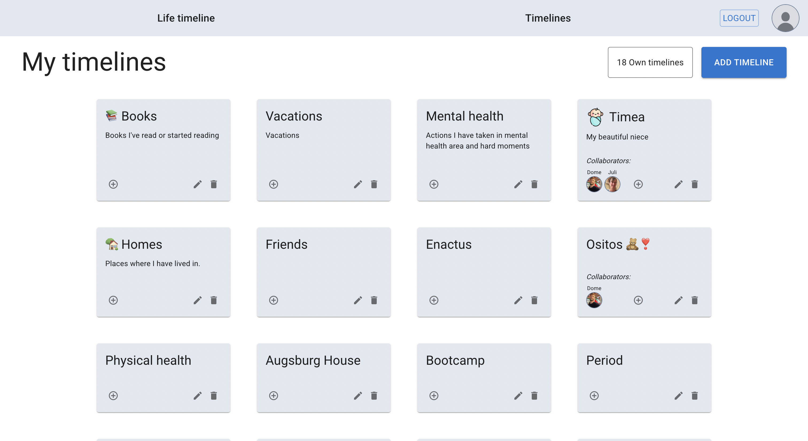
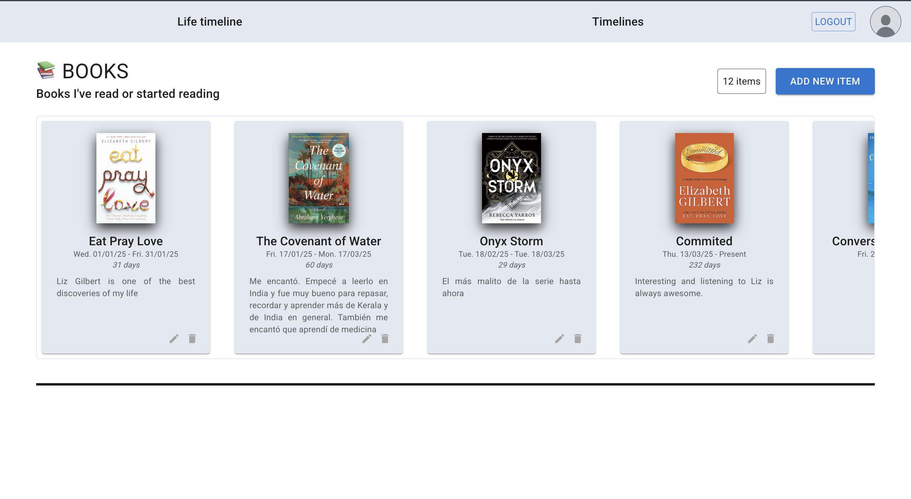

# Timeline Web Application

A modern, full-stack timeline visualization application built with React, TypeScript, and Node.js. Create, manage, and visualize personal timelines with interactive features and a beautiful Material-UI interface.

<div style="display: flex; align-items: center; gap: 12px; margin-bottom: 20px;">
    
   
   
</div>

## 🚀 Features

- **Interactive Timeline Visualization**: Built with vis-timeline for dynamic timeline viewing
- **User Authentication**: Secure sign-up/sign-in functionality
- **Timeline Management**: Create, edit, and delete personal timelines
- **Timeline Items**: Add detailed events to your timelines with rich content
- **Image Upload**: Upload and manage images for timeline events
- **Responsive Design**: Beautiful Material-UI components with dark/light mode support
- **Profile Management**: User profile customization
- **Protected Routes**: Secure access to authenticated content

## 🛠️ Tech Stack

### Frontend
- **React 19** - Modern React with latest features
- **TypeScript** - Type-safe development
- **Vite** - Lightning-fast build tool
- **Material-UI (MUI)** - Modern React component library
- **Tailwind CSS** - Utility-first CSS framework
- **React Router 7** - Client-side routing
- **vis-timeline** - Interactive timeline visualization
- **Axios** - HTTP client for API calls

### Backend
- **Node.js** - JavaScript runtime
- **Express.js** - Web application framework
- **TypeScript** - Type-safe backend development
- **MongoDB** - NoSQL database
- **Mongoose** - MongoDB object modeling
- **JWT** - JSON Web Tokens for authentication
- **Cloudinary** - Image upload and management
- **bcryptjs** - Password hashing

## 📦 Project Structure

```
m3-project-client/                 # Frontend React application
├── src/
│   ├── components/               # Reusable components
│   │   ├── Forms/               # Form components
│   │   ├── layout/              # Layout components
│   │   ├── styled/              # Styled components
│   │   └── vis-timeline/        # Timeline visualization
│   ├── pages/                   # Page components
│   ├── context/                 # React context providers
│   ├── services/                # API service configurations
│   ├── shared-theme/            # Theme and styling
│   ├── sign-in/                 # Authentication components
│   ├── sign-up/                 # Registration components
│   └── utils/                   # Utility functions
│
timeline-webapp-server/           # Backend Node.js application
├── src/
│   ├── config/                  # Configuration files
│   ├── db/                      # Database connection
│   ├── middlewares/             # Express middlewares
│   ├── models/                  # Mongoose models
│   ├── routes/                  # API routes
│   ├── types/                   # TypeScript type definitions
│   └── utils/                   # Utility functions
```

## 🚦 Getting Started

### Prerequisites
- Node.js (v18 or higher)
- npm or yarn
- MongoDB database
- Cloudinary account (for image uploads)

### Installation

1. **Clone the repository**
   ```bash
   git clone https://github.com/malejaroti/m3-project-client.git
   cd m3-project-client
   ```

2. **Install frontend dependencies**
   ```bash
   cd m3-project-client
   npm install
   ```

3. **Install backend dependencies**
   ```bash
   cd ../timeline-webapp-server
   npm install
   ```

4. **Set up environment variables**
   
   Frontend (`.env` in m3-project-client/):
   ```env
   VITE_SERVER_URL="http://localhost:5005"
   ```
   
   Backend (`.env` in timeline-webapp-server/):
   ```env
   PORT=5005
   MONGODB_URI=your_mongodb_connection_string
   JWT_SECRET=your_jwt_secret
   CLOUDINARY_NAME=your_cloudinary_name
   CLOUDINARY_KEY=your_cloudinary_key
   CLOUDINARY_SECRET=your_cloudinary_secret
   ```

### Running the Application

1. **Start the backend server**
   ```bash
   cd timeline-webapp-server
   npm run dev
   ```

2. **Start the frontend development server**
   ```bash
   cd m3-project-client
   npm run dev
   ```

3. **Open your browser**
   Navigate to `http://localhost:5173` to view the application.

## 📖 API Endpoints

- `POST /auth/signup` - User registration
- `POST /auth/login` - User login
- `GET /auth/verify` - Verify JWT token
- `GET /timelines` - Get user's timelines
- `POST /timelines` - Create a new timeline
- `PUT /timelines/:id` - Update a timeline
- `DELETE /timelines/:id` - Delete a timeline
- `GET /timeline-items/:timelineId` - Get timeline items
- `POST /timeline-items` - Create a timeline item
- `PUT /timeline-items/:id` - Update a timeline item
- `DELETE /timeline-items/:id` - Delete a timeline item
- `POST /upload` - Upload images

## 🎨 Features in Detail

### Timeline Visualization
- Interactive timeline interface using vis-timeline
- Zoom, pan, and navigate through timeline events
- Customizable timeline appearance and colors
- Timeline item details with rich content support

### User Management
- Secure authentication with JWT tokens
- User profile management
- Protected routes for authenticated users
- Password encryption with bcrypt

### Image Management
- Cloudinary integration for image uploads
- Image optimization and delivery
- Support for multiple image formats
- Drag-and-drop image upload interface

## 🔧 Available Scripts

### Frontend
- `npm run dev` - Start development server
- `npm run build` - Build for production
- `npm run preview` - Preview production build
- `npm run lint` - Run ESLint

### Backend
- `npm run dev` - Start development server with watch mode
- `npm run build` - Build TypeScript to JavaScript
- `npm run start` - Start production server
- `npm run type-check` - Check TypeScript types

## 🤝 Contributing

1. Fork the repository
2. Create your feature branch (`git checkout -b feature/AmazingFeature`)
3. Commit your changes (`git commit -m 'Add some AmazingFeature'`)
4. Push to the branch (`git push origin feature/AmazingFeature`)
5. Open a Pull Request

## 📝 License

This project is part of the Ironhack Web Development Bootcamp - Module 3 Project.

## 🙏 Acknowledgments

- Ironhack Web Development Bootcamp
- Material-UI team for the excellent component library
- vis-timeline for the timeline visualization library
- All the open-source contributors whose libraries made this project possible
